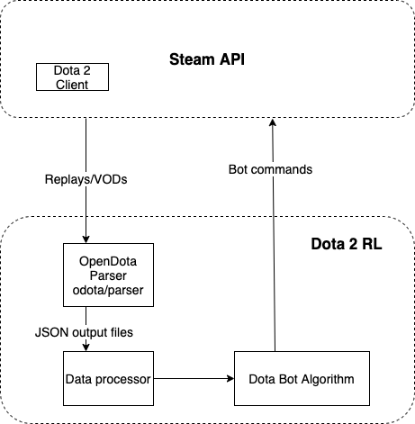

# dota2_bot_rl
Dota 2 bot powered by reinforcement learning and influenced by a rule engine.

## Technologies
- lua
- Java
- Docker
- docker-compose

The bot script itself will be written in lua.

There is more flexibility for the other components of Dota2 Bot RL. Currently we are aiming to use [OpenDota's Parser](https://github.com/odota/parser) to
analyze Dota 2 replays (`.dem` format), generating output in JSON format. OpenDota's Parser uses [Clarity](https://github.com/skadistats/clarity) to actually
do the parsing, which is a performant Java parser.

## Architecture Diagram
A high-level diagram for Dota2 Bot RL is shown below.

. 

The process flow is defined as follows:
1. The Steam API (whether directly or through the Dota 2 client) will be exercised to pull replay/VOD content (`.dem` format) to
Dota2 RL.
1. The replay parser will be run to analyze and filter out results that we want from the replays.
1. These files will be fed into a data processing agent which fuels the data models and updates the rule engine.
1. The output of the data processing agent will be used by the bot script to power its decision-making.
1. The bot script will be running and sending commands directly to the Steam API. Eventually this may be a dedicated Valve server -
need to research this more as the bot becomes more developed.

## Replays
In the Dota 2 client, you can download VODs for specific match IDs, which will save a `.dem` file at
`/Users/<username>/Library/Application Support/Steam/steamapps/common/dota 2 beta/game/dota/replays` on macOS.

## Parser
To run the parser, run `bin/start-dota2-bot-rl.sh`. This will spin up `odota-parser:latest`, pulling and building if it does not
already exist locally from Github.

Once the container is running, you can verify that it is running by sending a `curl` command:

```bash
curl -I 127.0.0.1:9000
```

To post a replay to the parser, use the following `curl` command:
```bash
curl 127.0.0.1:9000 --data-binary "@<replay_file>"
```

You can also view logs for the container:
```bash
docker logs odota-parser
```

You can stop the containers by running `bin/stop-dota2-bot-rl.sh`.
